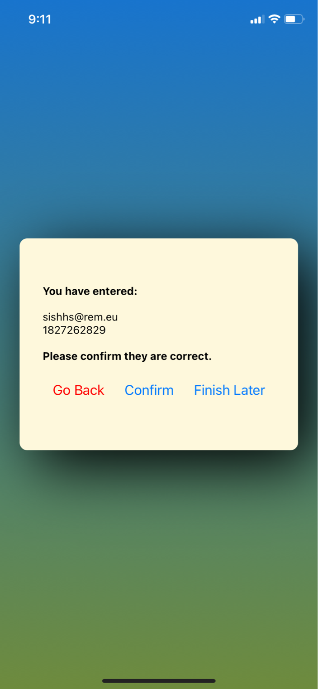

## CS 5520 Mobile Assignment 1

* Completed these features:

- [X] Email and Phone number Verification logic
- [X] Programmatically navigate among screens (controlled by 2 state variables)
- [X] Styles and Colors all come from 1 file (exported)
- [X] Confirm screen is wrapped in a Modal
- [X] Has 2 components: Cardo & HorizontalButton
- [X] Shows correct pic (there might be latency when loading the image though)
- [X] all buttons work correctly, and the inputs are kept / erased according to the requirement
- [X] Tested on both Android and iOS phones

* Screenshot of the App:

